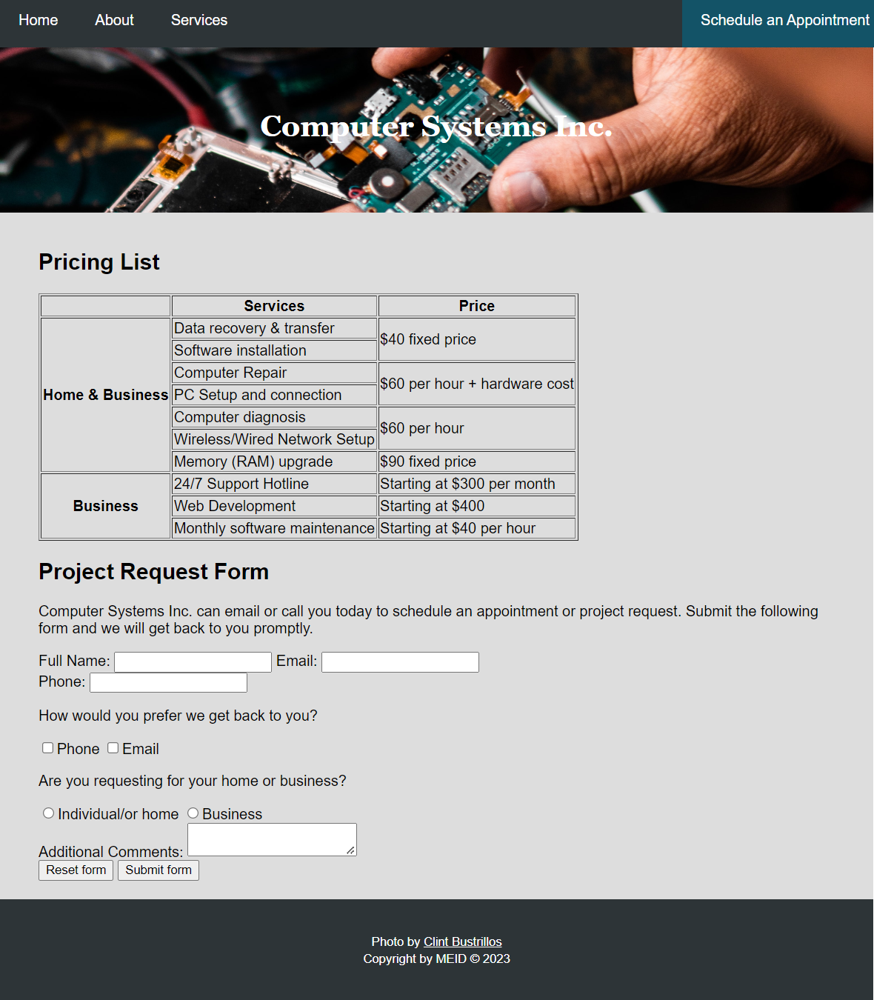
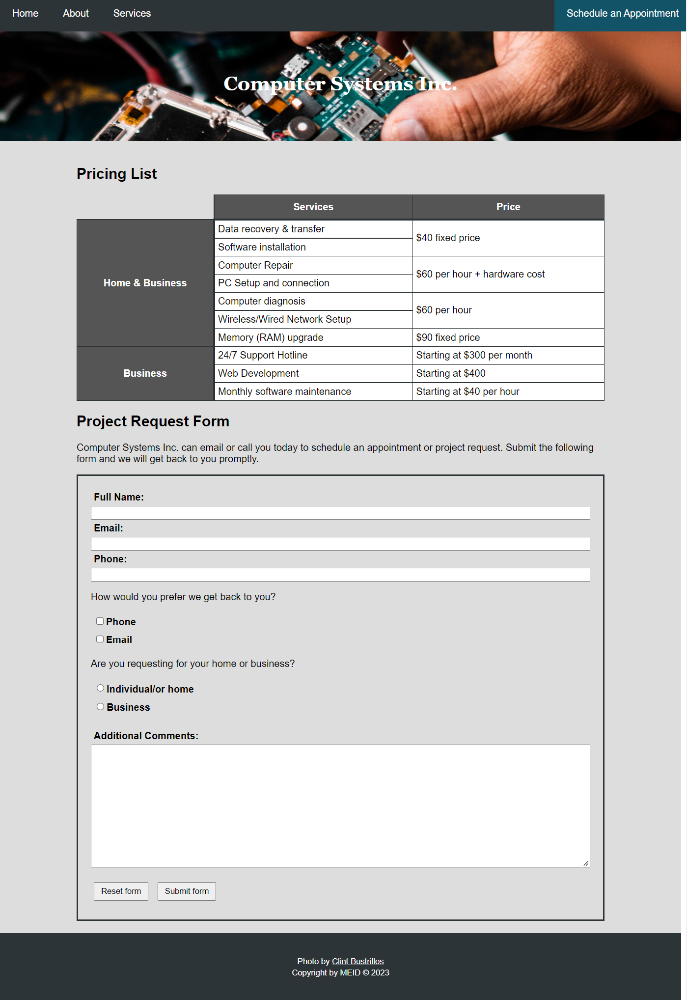

# Lesson 9
The computer company client has received would like you to make a web page that displays the company's contact information. With your help from Lesson 6, they'd also like to include links to social media platforms which they plan to make profiles on in the near future. They'd like to include a table on the page to 

## Project Prep
1. If you haven't done so already, clone the repo to your computer within your course folder.
2. Open the repo within VS Code. You can open this `readme.md` file within VS Code to view the project directions there. 

   > **TIP:** Right click on the file and choose the `Open Preview` option.
3. If there are files and folders present other than this `readme.md` file, take some time to familiarize yourself with the files within the repo so you know where they are located. This will help you when asked to use them within the project directions.

   > **TIP:** Before beginning any work on the project, read through all the steps to understand what you will be doing.
4. You will create a table below, use the correct number of columns and rows to display the following details. Reviewing this information first will help you determine the structure of the table. 
   - There are seven services offered to both Home & Business users that includes:
      - Offered at a $40 fixed price:
         - Data recovery & transfer
         - Software installation
      - Offered at $60 per hour + hardware costs:
         - Computer repair
         - PC setup and connection
      - Offered at $60 per hour:
         - Computer diagnosis
         - Wireless/Wired network setup
      - Memory (RAM) upgrade which is offered at a $90 fixed price
   - There are three services offered to Business users:
      - 24/7 Support Hotline whose pricing starts at $300 per month
      - Web development whose pricing starts at $400
      - Monthly software maintenance whose pricing starts at $40 per hour

 

## Create the Contact Page

1. Save a copy of the template.html file to your Lesson 9 folder as: **schedule.html**
0. Update the metadata with the following:
    - Change the title to: **Schedule an Appointment**
    - Define the author using your first and last name.
    - Add a minimum of 5 keywords appropriate for the page content.
    - Add an appropriate description.
0. Apply the **active** class to the "Schedule an appointment" link.
0. Within the main section, remove the paragraph of placeholder text.
0. Within the main section, create two second level headings. The first heading should display: **Pricing List** and the second heading should display: **Project Request Form**
0. Below the Pricing List heading, create a table utilizing the table data provided to you in the project prep.
   - In the first row, create header cells for the appropriate cells to display: **Services** and **Price**
      > **NOTE:** You should have an empty cell or table heading to the left of the Services cell.
   - In the first column, create header cells for the appropriate cells to display: **Home & Business** and **Business**.
   - Create rows and table cells per row for each necessary entry within the table. When the information is same between adjacent rows, make sure the cell correctly spans the row.
0. Below the "Project Request Form" heading, create a paragraph that displays the following information: 
      ><code>Computer Systems Inc. can email or call you today to schedule an appointment or project request. Submit the following form and we will get back to you promptly.</code>
0. Create a form with the following information:
   - Apply an attribute to the form that will allow you to test the data when the form is submitted. **TIP:** Review Lesson 8, Introduction to Forms and the *Postback script* that has been provided to you.
   - Use the appropriate text input field to allow users to submit the following details: **First and Last Name**, **Email**, and **Phone**.
      - Use a binding method that will provide the most flexibility to style the elements using unique id attributes.
      > **TIP:** You will style your form later in the lesson to make each element display as block elements, therefore you should not add any line breaks to the form unless stated.
   - Add a paragraph that displays: 
      ><code>How would you prefer we get back to you?</code>
   - Create checkable options to allow for one or more choices of contact. Display the following options: **Phone** or **Email**.
      - Use a binding method to make the input child elements of the label. 
   - Add a paragraph that displays:
      ><code>Are you requesting for your home or business?</code>
   - Create an input field that will allow the user to select one of the following options: **Individual/Home** or **Business**
      - Use a binding method to make the input child elements of the label.
   - Create a field that will allow the user to type in multiple lines of text. 
      - Use a binding method that will provide the most flexibility to style the elements using unique id attributes.
      - The label should display: **Additional Comments**
   - Add a line break to display the following below on it's own line.
   - Create a reset and submit button at the bottom of the form. Display the following text for the appropriate button: **Reset form** and **Submit Form**

### Example Project
This is an example of what the project should look like at this point in the lesson. **NOTE:** The table borders have shown in this example, your project may not appear the same exact way.

## Style the Contact Page
1. If necessary, open the external stylesheet.
0. Update the multi-lined comment to add your MEID, course and section number, and current lesson number.
>**NOTE:** For the remaining steps in the lesson, determine if you can apply the styles by targeting existing HTML selectors or if you must utilize a class or id selector.
3. Above the Footer Styles, create a comment that displays: **Table Styles**.
0. Style the table to:
   - Collapse the border.
   - Adjust the width to be 100% of the container.
0. Style all table headers and table cells to:
   - Add a thin solid dark border of your desired color method on all sides of the elements.
   - Add a white background color of your desired color method.
   - Apply 5px of padding on all sides.
0. Style the table header to apply additional styling:
   - Add a dark background color of your desired color method.
   - Change the text color to white using your desired color method.
   - Apply 10px of padding on all sides.
0. Style the first cell to have no borders or background color.
0. Style the top table headers to adjust the bottom border width to be medium instead of thin.
0. Style the left table headers to adjust the right border width to be medium instead of thin.
0. Below the table styles, create a comment that displays: **Form Styles**.
0. Style the form to:
   - Apply a thin solid dark border on all sides of the element.
   - Apply 20px of padding to all sides.
0. Style all field labels to:
      - Display as block elements.
      - Adjust the font weight to bold.
      - Apply 5px of padding to all sides.
0. Style the Full Name, Email, and Phone text input fields to"
      - Change the width so it spans 100% of the layout.
      - Apply an appropriate box-sizing method so that any borders, margins, or padding are subtracted from the width.
0. Style the textarea to:
      - Change the width so it spans 100% of the layout.
      - Change the height to 200px.
      - Apply an appropriate box-sizing method so that any borders, margins, or padding are subtracted from the box model.
      - Add a bottom margin of 10px.
0. Style the form buttons to:
   - Add a top and bottom margin of 10px and left and right margin of 5px.
   - Apply 5px of padding to the top and bottom sides of the element and 10px of padding to the left and right sides
0. Create a selector to apply a hover effect to the form buttons according to the following:
   - Add a dark background color of your desired color method.
   - Adjust the text color to your desired color method.

### Example Project
Below is a rendering of an example project, your web page may not appear the exact same.

## Submit the Project
Before you submit your project:
1. Save your files and apply any final commits to your work.
0. Push (i.e., sync) the repo on your computer with GitHub to ensure all files are uploaded for your instructor to see.
0. Verify that all files appear on GitHub.

   > **TIP:** You can view any of your repos by going to the GitHub organization for the course - [RSC-computer-technology](https://github.com/rsc-computer-technology). You can bookmark the page for future reference. 
0. Open the Pull Requests tab within GitHub (or using the GitHub Extension within VS Code).
0. In the comment field, 
   - Type in your instructor's username with an `@` before. See the course announcements for their username to use. 
   - Put a note to your instructor that the assignment is ready to grade.
0. Click on the `Comment` button to finalize and submit your assignment to GitHub for review.
0. Lastly, submit the Project to your **Gradebook** using the steps within **Assessing Your Learning** in Lesson 9.
